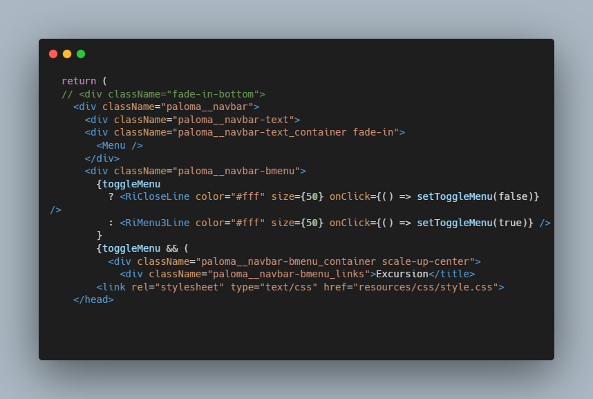
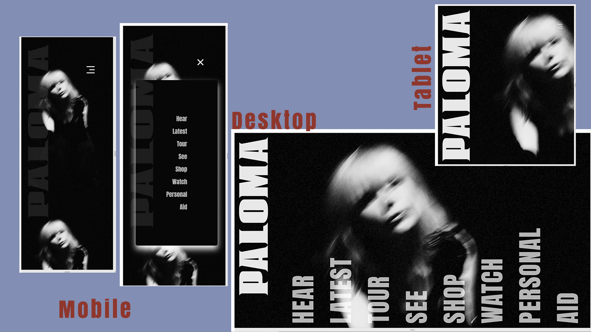

# Paloma Test - Agile Pixel

### Description

Using the provided figma design, I have implemented code to create a fully responsive web page. My Approach to work was to create a simple yet effect webpage, that focuses on the user experience.

I first reviewed the design in depth, making a few changes by converting everything to frames, as well as renaming the potential divs. I then also utilized auto-layout features to better position elements for development.

I then decided to remake this webpage using react, to reuse components, creating less code and better file structure.

This was also if for any reason that the webpage needed more development it would be easy to add more components and features as well as collaboration.

After layout I focused on responsiveness and changes for media queries. You can see that below a certain width the user will only have the option of a hamburger menu.

Assuming the project is in reference to music, I wanted to replicate a wall poster.
Therefore keeping the page minimal to highlight the client or artist.

It was great undertaking this task I especially had fun creating a vertically aligned
bottom right navigation menu.

### Technology

- Javascript
- React.js
- BEM
- Animista - CSS Animations 

### How to use

### Code Snippet

### Links

For more of my work visit:

---

---

[Personal Profile](https://perrellarray.netlify.app/)

# paloma-test-page
